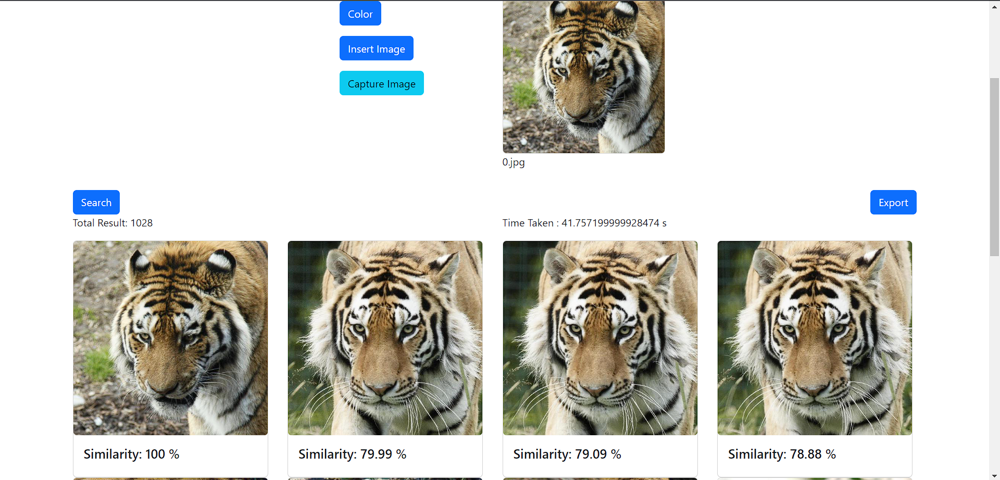

# Tubes Algeo02-22133
> We created this website to fulfill assignments in linear algebra and geometry.

## Table of Contents
* [General Info](#general-information)
* [Structure](#structure)
* [Technologies Used](#technologies-used)
* [Features](#features)
* [Screenshots](#screenshots)
* [Setup](#setup)
* [Usage](#usage)
* [Project Status](#project-status)
* [Room for Improvement](#room-for-improvement)
* [Acknowledgements](#acknowledgements)
* [Contact](#contact)
<!-- * [License](#license) -->


## General Information
- The system enables users to explore visual information stored across various platforms, whether in the form of personal image searches, medical image analysis for diagnosis, scientific illustration searches,   or commercial product searches based on images.

## Structure
``` bash
.
└── Algeo02-22133/
    ├── doc
    ├── img
    ├── src/
    │   └── react-flask-app/
    │       ├── api/
    │       │   ├── _pycache_
    │       │   ├── venv
    │       │   ├── .flaskenv
    │       │   ├── api.py
    │       │   ├── color.py
    │       │   └── texture.py
    │       ├── public
    │       └── src/
    │           ├── components/
    │           │   ├── About.js
    │           │   ├── AboutContainer.js
    │           │   ├── Concept.js
    │           │   ├── ConceptContainer.js
    │           │   ├── HTUContainer.js
    │           │   ├── Header.js
    │           │   ├── Home.js
    │           │   ├── HowToUse.js
    │           │   ├── ImageUploadButton.js
    │           │   ├── LPContainer.js
    │           │   ├── LandingPage.js
    │           │   ├── Navbar.js
    │           │   ├── Result.js
    │           │   └── loading.css
    │           ├── img
    │           ├── App.js
    │           └── index.js
    ├── test
    ├── README.md
    └── requirements.txt
```

## Technologies Used
- React - version 18.2.0
- Flask - version 3.0.0


## Features
List the ready features here:
- Color Based Image Retrieval
- Texture Based Image Retrieval
- Image Scraping
- Image retrieval using captured images from a webcam
- Export the results in PDF format


## Screenshots

Click this link for other examples [click here](./img)


## Setup
Click on this link to access the requirements.txt file [click here](./requirements.txt).
You also need to install Yarn and npm. We recommend using Python version 3.8.x to 3.10.x


## Usage
1. `git clone https://github.com/mroihn/Algeo02-22133.git `
2. `cd .\src\react-flask-app\ `
3. `yarn start`
4. `cd .\src\react-flask-app\api\`
5. `python api.py`


## Project Status
Project is: _in progress_ / _complete_ / _no longer being worked on_. If you are no longer working on it, provide reasons why.


## Room for Improvement
Room for improvement:
- We have not yet implemented caching results of computations for a dataset to enhance efficiency and effectiveness when the dataset is used repeatedly.
- We have not yet employed an object detector capable of processing and cropping input images, aiming to enhance the maximization of the provided results.

To do:
- Implement caching result
- Implement object detector


## Acknowledgements
Give credit here.
- This project was inspired by...
- This project was based on [this tutorial](https://www.example.com).
- Many thanks to...


## Contact
Feel free to contact us!
- Email (Yosef) : 13522133@std.stei.itb.ac.id
- Email (Roihan) : 13522152@std.stei.itb.ac.id
- Email (Rayhan) : 13522160@std.stei.itb.ac.id


<!-- Optional -->
<!-- ## License -->
<!-- This project is open source and available under the [... License](). -->

<!-- You don't have to include all sections - just the one's relevant to your project -->
